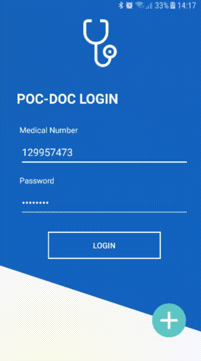
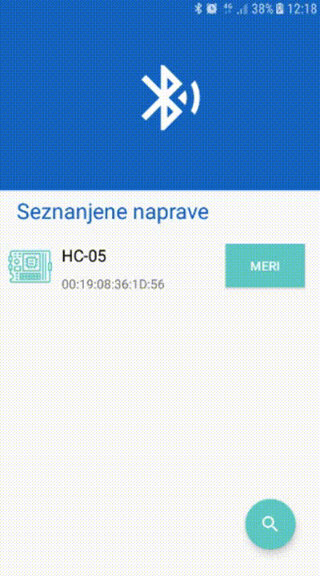
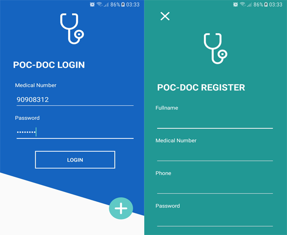
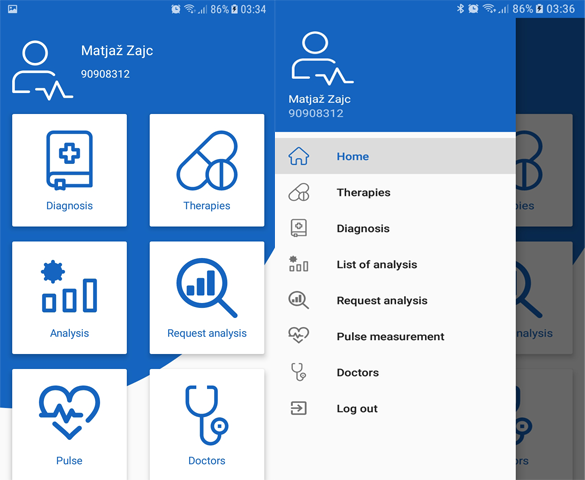
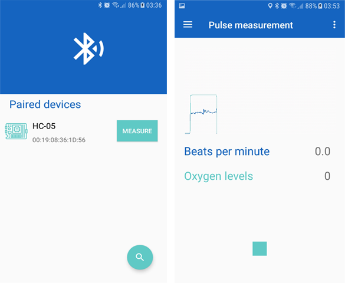
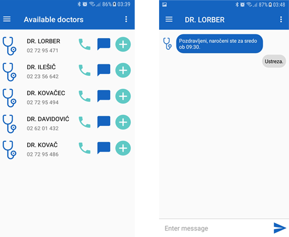

# Pocket-Doctor Android
> This repository is patient-oriented part of the project. Here you can find all information about the idea and the structure of android application. 

## Table of contents
* [General info](#general-info)
* [Screenshots](#screenshots)
* [Technologies](#technologies)
* [Setup](#setup)
* [Features](#features)
* [Status](#status)
* [Inspiration](#inspiration)
* [Contact](#contact)

## General info
Pocket Doctor is an app intented to simulate the usage of blockchain in a healthcare system. It was developed as a student project with a potential to grow. So far it consists out of 6 repositories :
* Android (this one)
* [Blockchain](https://github.com/PetrovicGoran/poc-doc-blockchain)
* [Backend](https://github.com/PetrovicGoran/poc-doc-backend)
* [Frontend](https://github.com/PetrovicGoran/poc-doc-frontend)
* [Arduino](https://github.com/JanaJankovic/poc-doc-arduino)
* [Recognition](https://github.com/JanaJankovic/poc-doc-recognition)

You can see whole presention [here](https://univerzamb-my.sharepoint.com/:p:/g/personal/jana_jankovic_student_um_si/ETQo1_cbyKlDnSKktxM6_YABnMsRZP8nEeGqBBbXq_wHtg?e=2ceRYw)

## Demo
 

## Screenshots
  
  
  
  

## Technologies
* Java
* Android Studio - version 4.1.1
* LibGdx - 1.9.11

## Setup
Download code and install it on your phone using Android Studio. 
In package `config` change IP with the one you get from `ipconfig` and make sure your phone is in the same network. 
Make sure you have paired with bluetooth module from before using it in app.

## Structure
Packages :
* `activities`
* `fragments`
* `events` - all events in event bus
* `adapters` - all adapters for `RecyclerView`
* `network` - network utils for communicating with blockchain and backend
* `config` - configuration settings

Modules :
* `datalib` - data structure
* `core` - libgdx for displaying realtime graph

## Features
Pocket-Doctor application has next features :
* Login/Registraction forms
* Settings
* Chat with doctors
* Bluetooth communication with Arduino Nano board and sensor
* Realtime graph of heart rate and oxygen levels
* Listing diagnoses and therapies from blockchain
* Taking a picture/choosing picture from gallery
* Classifying moles and skin cancer
* Showing all pending requests for mentioned classification
* Listing available doctors

To-do list:
* Implement calls 
* Implement service for notifications
* Make more complex structure of diagnoses and theapies
* Fix bug with registring and logging in

## Status
Project is: _in progress_ 
Project is still in development, because it still lacks some basic functionalities to be considered finished and usable product.

## Inspiration
Project is supported by [The Faculty of Electrical Engineering and Computer Science](https://feri.um.si/) and [University of Maribor](https://www.um.si/Strani/default.aspx).

## Contact
Created by [Jana Jankovic](https://github.com/JanaJankovic) - feel free to contact me on one of the emails :
* jana.jankovic@student.um.si
* jana.j00@outlook.com
* jana.jankovic.feri@gmail.com

Supported by [Goran Petrovic](https://github.com/PetrovicGoran) - feel free to contact him :
* goran.petrovic1@student.um.si

Supported by [Nikola Vilar Jordanovski](https://github.com/NikolaVilar) - feel free to contact him :
* nikola.vialr@student.um.si

