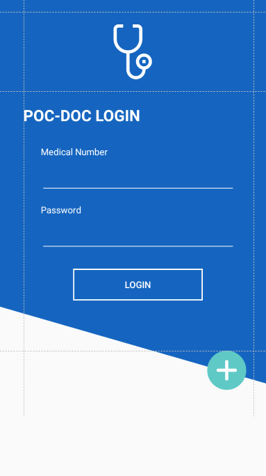
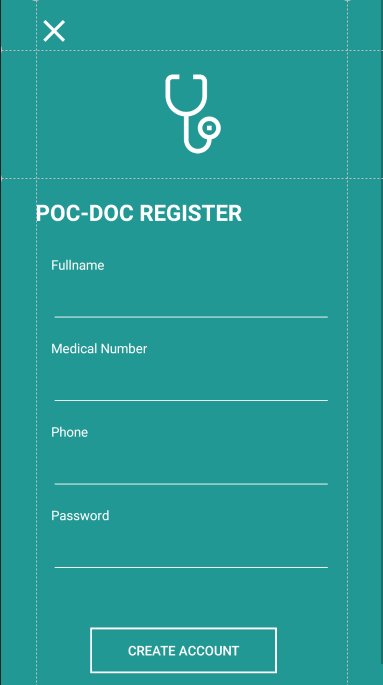
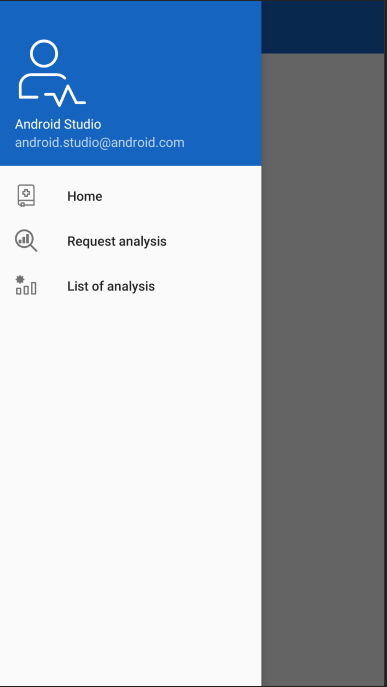

# PocDoc *Android*

## Data Struktura
* Analysis
```java
    public Analysis(String filePath) {
        this.filePath = filePath;
    }

    public String getFilePath() {
        return filePath;
    }

    public void setFilePath(String filePath) {
        this.filePath = filePath;
    }

    public ArrayList<String> getPossibleIllnesses() {
        return possibleIllnesses;
    }

```


* Diagnosis
```java
   private String name;
   private String description;
   private ArrayList<Therapy> therapyList;
```
```java
    public void addTherapyToList(Therapy t) {
            if(! therapyList.contains(t))
                therapyList.add(t);
        }
    
    public void removeFromTherapyList(Therapy t) {
        if(therapyList.contains(t))
            therapyList.remove(t);
    }
```


* Doctor
```java
    private String publicKey;
    private String fullName;
    private String phone;
    private String location;
    private String email;
```


* MeasureData
```java
    ArrayList<Integer> bitsPerMinute;
    ArrayList<Integer> spo2;
```

```java
    public void addBitPerMinuteToList(int bpm) {
        bitsPerMinute.add(bpm);
    }
    
    public void addSpo2ToList(int spo2) {
        this.spo2.add(spo2);
    }
```


* Therapy
```java
    private String name;
    private String description;
    private String startDate;
    private String endDate;
    private int repetition;
```


* User
```java
    private String privateKey;
    private String publicKey;
    private String medicalNumber;
    private String fullName;
    private String password;
    private String phone;
    private String location;
    private ArrayList<Doctor> doctorList;
    private ArrayList<Diagnosis> diagnosisList;
```
```java
    public void addDoctorToList(Doctor d) {
        if(! doctorList.contains(d) )
            doctorList.add(d);
    }

    public void removeDoctorFromList(Doctor d) {
        if(doctorList.contains(d))
            doctorList.remove(d);
    }
```


## Classes & Activities

* activities
    * LoginActivity
    ```java
    public void onClickRegister() {
        this.startActivityForResult(
                new Intent(this.getBaseContext(), RegisterActivity.class),
                REQUEST_CODE);
    }
    
    @Override
    protected void onActivityResult(int requestCode, int resultCode, Intent data) {
        super.onActivityResult(requestCode, resultCode, data);
        if (requestCode == REQUEST_CODE && resultCode == RESULT_OK) {
            Toast.makeText(getBaseContext(), "User added", Toast.LENGTH_LONG).show();
        } else if (resultCode == RESULT_CANCELED) {
            Toast.makeText(getBaseContext(), "Cancelled", Toast.LENGTH_LONG).show();
        }
    }
    ```
    * RegisterActivity
    ```java
     public void onButtonRegisterClick() {
            if(!fullnameText.getText().toString().equals("") && !phoneText.getText().toString().equals("") &&
            !medicalNumberText.getText().toString().equals("") && !passwordText.getText().toString().equals("")) {
                if (passwordText.getText().toString().length() < 8) {
                    Toast.makeText(getBaseContext(), "Password is too short", Toast.LENGTH_LONG).show();
                } else {
                   // user = new User(medicalNumberText.getText().toString(), fullnameText.getText().toString()
                        //    , passwordText.getText().toString(), phoneText.getText().toString());
    
                    //API REQUEST
    
                    ApplicationState.saveLoggedUser(user);
                    Intent data = new Intent();
                    setResult(RESULT_OK, data);
                    finish();
                }
            } else {
                Toast.makeText(getBaseContext(), "All fields are required", Toast.LENGTH_LONG).show();
            }
        }
    ```
    * UserNavigationActivity
    ```java
        private AppBarConfiguration mAppBarConfiguration;
        public static Toolbar toolbar;
        private DrawerLayout drawer;
        public static NavigationView navigationView;
        private  NavController navController;
    ```
  
  ```java
  navigationView.setNavigationItemSelectedListener(new NavigationView.OnNavigationItemSelectedListener() {
              @Override
              public boolean onNavigationItemSelected(@NonNull MenuItem item) {
                  switch (item.getItemId()) {
                      case R.id.nav_home :
                          toolbar.setTitle(R.string.menu_home);
                          getSupportFragmentManager().beginTransaction()
                                  .replace(R.id.nav_host_fragment, new HomeFragment()).commit();
                          drawer.closeDrawer(GravityCompat.START);
                          break;
                      case R.id.nav_request_analysis:
                          toolbar.setTitle("Request analysis");
                          getSupportFragmentManager().beginTransaction()
                                  .replace(R.id.nav_host_fragment, new RequestAnalysisFragment()).commit();
                          drawer.closeDrawer(GravityCompat.START);
                          break;
                      case R.id.nav_list_analysis :
                          toolbar.setTitle("List analysis");
                          getSupportFragmentManager().beginTransaction()
                                  .replace(R.id.nav_host_fragment, new ListAnalysisFragment()).commit();
                          drawer.closeDrawer(GravityCompat.START);
                          break;
                  }
                  return true;
      }
          });
  ```
  
  ```java
  @Override
      public boolean onCreateOptionsMenu(Menu menu) {
          getMenuInflater().inflate(R.menu.user_navigation, menu);
          return true;
      }
  
      @Override
      public boolean onSupportNavigateUp() {
          NavController navController = Navigation.findNavController(this, R.id.nav_host_fragment);
          return NavigationUI.navigateUp(navController, mAppBarConfiguration)
                  || super.onSupportNavigateUp();
      }
    ```
  
  
* fragments
    * HomeFragments
    * ListAnalysisFragments
    * RequestAnalysisFragments
    ```java
     private void pickCamera() {
            askForPermission();
        }
    
        private void pickGallery() {
            Intent intent = new Intent(Intent.ACTION_PICK, MediaStore.Images.Media.EXTERNAL_CONTENT_URI);
            startActivityForResult(intent, REQUEST_GALLERY);
        }
    ``` 
  ```java
     private void pickGallery() {
             Intent intent = new Intent(Intent.ACTION_PICK, MediaStore.Images.Media.EXTERNAL_CONTENT_URI);
             startActivityForResult(intent, REQUEST_GALLERY);
         }
     
     
         //PERMISSION
         private void askForPermission() {
             if(ContextCompat.checkSelfPermission(getActivity().getBaseContext(), Manifest.permission.CAMERA) !=
                     PackageManager.PERMISSION_GRANTED) {
                 ActivityCompat.requestPermissions(getActivity(), new String[] {Manifest.permission.CAMERA}, REQUEST_CAMERA);
             } else {
                 dispatchTakePictureIntent();
             }
         }
   ```
    * SendFragments
    ```java
    public View onCreateView(@NonNull LayoutInflater inflater,
                             ViewGroup container, Bundle savedInstanceState) {
            super.onCreate(savedInstanceState);
            if (container != null) {
                container.removeAllViews();
            }
            final ViewGroup rootView = (ViewGroup) inflater.inflate(
                    R.layout.fragment_send_request, null);
    
            bindGUI(rootView);
            ((UserNavigationActivity) requireActivity()).getSupportActionBar().hide();
            getActivity().getWindow().setFlags(WindowManager.LayoutParams.FLAG_FULLSCREEN,
                    WindowManager.LayoutParams.FLAG_FULLSCREEN);
            setPictureBackground(rootView);
    
            buttonCancel.setOnClickListener(new View.OnClickListener() {
                @Override
                public void onClick(View v) {
                    ((UserNavigationActivity) requireActivity()).getSupportActionBar().show();
                    getActivity().getSupportFragmentManager()
                            .beginTransaction().replace(R.id.nav_host_fragment, new RequestAnalysisFragment()).commit();
                }
            });
    
            return  rootView;
        }
  
    ```
    
* ApplicationState
```java
public static Gson getGson() {...}

public static boolean checkLoggedUser(){...}

public static User loadLoggedUser() {...}

public static void saveLoggedUser(User user) {...}
```


## Examples
* Login


* Register


* Nav bar


